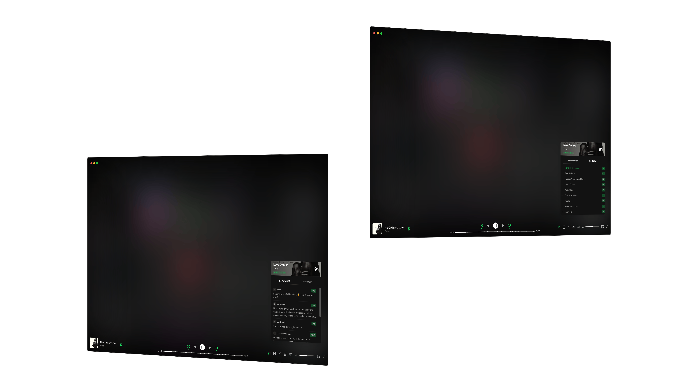

# better-aoty

A spicetify extension that shows album ratings from albumoftheyear.org directly in your player.



## Installation

### Linux/macOS

```bash
curl -fsSL https://raw.githubusercontent.com/spkrbox/better-aoty/refs/heads/master/scripts/install.sh | sh
```

### Windows

```powershell
iwr -useb https://raw.githubusercontent.com/spkrbox/better-aoty/refs/heads/master/scripts/install.ps1 | iex
```

## Manual Installation

If you prefer to install manually:

1. Download the `better-aoty.js` from the [dist](https://raw.githubusercontent.com/spkrbox/better-aoty/dist/better-aoty.js) folder
2. Place it in your Spicetify extensions folder:
    - Linux/macOS: `~/.config/spicetify/Extensions/`
    - Windows: `%appdata%\spicetify\Extensions\`
3. Enable the extension:
    ```bash
    spicetify config extensions better-aoty.js
    spicetify apply
    ```
